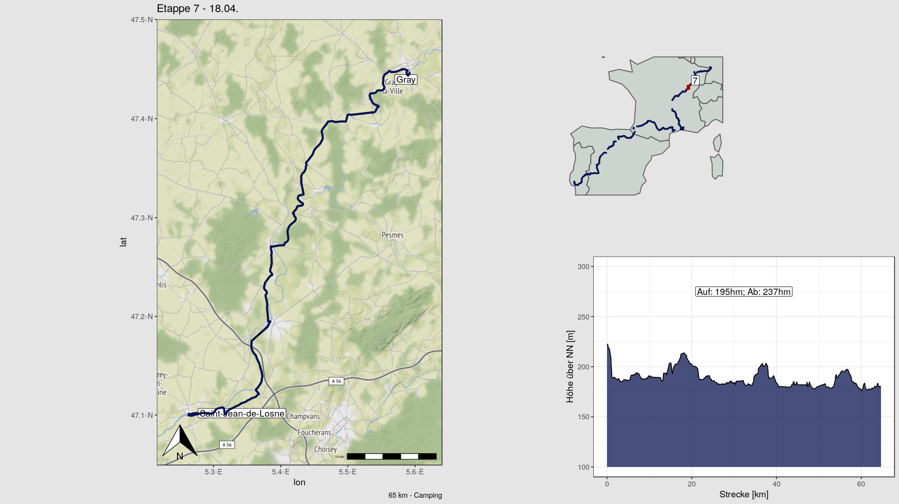

# Bikepacking maps
Creating daily multipanel maps, elevation diagramms and summaries in one plot for a bikepacking trip from .gpx tracks. 
The project uses the R-Ecosystem while relying heavily on the following packages: 
- [sf](https://cran.r-project.org/web/packages/sf/index.html) for handling spatial vector data
- [raster](https://cran.r-project.org/web/packages/raster/index.html) for handling spatial raster data
- [ggplot2](https://cran.r-project.org/web/packages/ggplot2/index.html) to draw the beautiful multipanel graphics and its extensions for spatial data:
  - [ggspatial](https://cran.r-project.org/web/packages/ggspatial/index.html)
  - [ggmap](https://cran.r-project.org/web/packages/ggmap/) 

## Motivation
After a two months bikepacking trip from southern Germany to the atlantic coast of Portugal, I wanted to prepare a slideshow of photos ordered by date including a daily infographic which should display the following:
- A Map of the route travelled this day
- A small inlet, locating the route in western Europe
- a summary on accomodation and hosts
- The statistics distance travelled and elevation gain
- an elevation profile

An example generated from the scripts looks like this:

## Data
The project used the following data sources:
- *.gpx track files* containing the routes in EPSG:4326. 
- *DEM-Tiles* in the geotiff raster format from the [Platform for Big Data in Agriculture](https://bigdata.cgiar.org/srtm-90m-digital-elevation-database/). EPSG:4326. Resolution 5 * 5 deg (90m at the equator)
- *Location Names* queried using the [revgeo-package](https://cran.r-project.org/web/packages/revgeo/)
- *Accommodation and Hosts* were entered from handwritten notes into a prompt from one of the functions

## Workflow
1. [00_packages.R](./scripts/00_packages.R): includes a vector of all necessary packages and installs if necessary. Saves the vector of packages as an .RData file
2. [01_data_wrangling_feature_engineering.R](./scripts/01_data_wrangling_feature_engineering.R):
  - reads the .gpx tracks and stores them as Linestrings in a simple-feature-collection (sfc). An sfc which is a data-frame like object with a column containing the georeferenced coordinates of the linestring. The sfc contains one row for each route
  - extracts start and stop locations from the tracks and queries the names of the locations using the revgeo-package and stores these in a second sfc
  - Casts the first sfc of Linestrings to a Point-sfc for each track and extracts elevation data for each point. The elevation gain is calculated 
3. [02_layout_plots.R](./scripts/02_layout_plots.R):
  - creates a map of the track with a background using the ggmap-API and the location names of the start and stop of the day
  - a line-graph of the elevation profile
  - small inlet, locating the route in western Europe
  - information on elevation gain, distance travelled, accommodation, hosts etc.
  - assembles these into a multipanel plot object
4. [03_order_plots_photos.R](./scripts/03_order_plots_photos.R) extracts the information of the date and time from the photos and renames the photos according to this, so that these can be displayed in slideshow together with the plots

